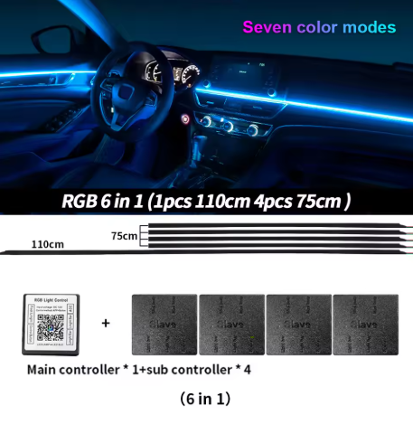
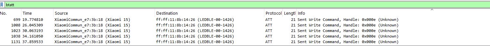
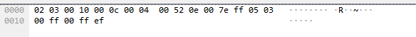
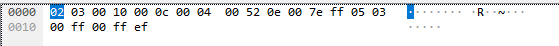
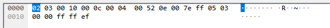

# Basic information
This project is aimed around these super cheap generic ambient lighting kits



The app used to control these is named "LED LAMP"

# How do they work?
They generally have one master node that supports BLE which relays the commands from the app to the slaves (using much cheaper 433MHz or 2.4Ghz radios)

# Breakdown
I logged the the bluetooth traffic coming from my phone when using the app (setting the strip to red etc.) and used wireshark to walk through the frames sent (looking specifically for write commands)



If we look at the payloads





| Index | Hex Byte | Purpose           |                                                                                                                                                                |
|-------|----------|-------------------|----------------------------------------------------------------------------------------------------------------------------------------------------------------|
| 0     | 0x7E     | Header            |                                                                                                                                                                |
| 1     | 0xFF     | ZoneID            | In this case broadcast                                                                                                                                         |
| 2     | 0x05     | Command Group     | 0x05 = Color operation; 0x04 = Power operation                                                                                                                 |
| 3     | 0x03     | Action Identifier | The specific action within the group.; If Byte 2 is 05 (Color): 0x03 means "Apply RGB Values".; If Byte 2 is 04 (Power): 0x01 means "ON" and 0x00 means "OFF". |
| 4     | 0xFF     | RED Value         |                                                                                                                                                                |
| 5     | 0x00     | GREEN Value       |                                                                                                                                                                |
| 6     | 0x00     | BLUE Value        |                                                                                                                                                                |
| 7     | 0xFF     | Alpha?            | Might be brightness, will investigate                                                                                                                          |
| 8     | 0xEF     | Footer            |           

# Examples
```
7e ff 05 03 ff 00 00 ff ef - FULL RED
7e ff 05 03 00 ff 00 ff ef - FULL GREEN
7e ff 05 03 00 00 ff ff ef - FULL BLUE
```

# Controlling it with an esp32
This is an example function to change the color (needs to have the connection setup beforehand, check the esp32-specific writeup for more details)
```c++
void setColor(uint8_t red, uint8_t green, uint8_t blue) {
  if (pRemoteCharacteristic == nullptr) return;
  
  // Building the payload: 7e ff 05 03 [R] [G] [B] ff ef
  uint8_t payload[9] = {0x7E, 0xFF, 0x05, 0x03, red, green, blue, 0xFF, 0xEF};
  
  // Write the payload (true = Write Without Response)
  pRemoteCharacteristic->writeValue(payload, sizeof(payload), true);
  Serial.printf("Sent Color Command - R:%d G:%d B:%d\n", red, green, blue);
}
```
